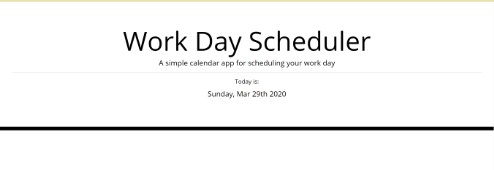
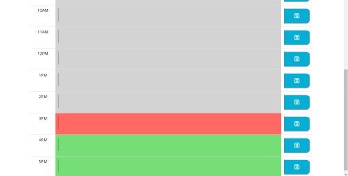

# daily_planner
Daily planner to organize your day. Part my coding bootcamp studies (homework #5).

Includes time blocks from 9AM to 5PM to accomodate your work schedule.

Color coded time blocks, indicate current, future and past tasks.

Users can input their tasks and hit the save button. Tasks will remain there until substituted with another task.

### Installing

- Run index.html on your favorite browser.
- Be sure to keep all files in the same directory.

Here is a sample of the 3 screens this portfolio consists of:

**You can also access the game by clicking [here](https://dmjohnspor.github.io/daily_planner/).**

## Built With

* [Visual Studio Code](https://code.visualstudio.com/) - For standard coding.
* [jQuery](https://jquery.com/) - Javascript library.
* [Bootstrap](https://getbootstrap.com/) - Front-end component library.
* [Pixlr](https://pixlr.com/) - Used to edit the images and screenshots used.

## Contributing

Please read [CONTRIBUTING.md](https://gist.github.com/PurpleBooth/b24679402957c63ec426) for details on our code of conduct, and the process for submitting pull requests to us.

## Versioning

We use [SemVer](http://semver.org/) for versioning. For the versions available, see the [tags on this repository](https://github.com/dmjohnspor/Sporidis-Foster_Portfolio/commits/master). 

## Authors

* **Ioannis Sporidis-Foster** - *Initial work* - [dmjohnspor](https://github.com/dmjohnspor)
* **Anthony Briglia** - *Instruction, guidance and corrections*
* **Artan Muzhaqi** - *Guidance and corrections*
* **Tom Woods** - *Guidance and corrections*

## Acknowledgments

* Hat tip to anyone whose code was used.
* A big thank you to Anthony, Tani and Tom for all their support and guidance.
* An even better thank you to Tani for all the time he spent with me and the valuable guidance he provided.
* To all my fellow classmates in the bootcamp. Thank you for your continuing help and support!
* Stay healthy and safe!

